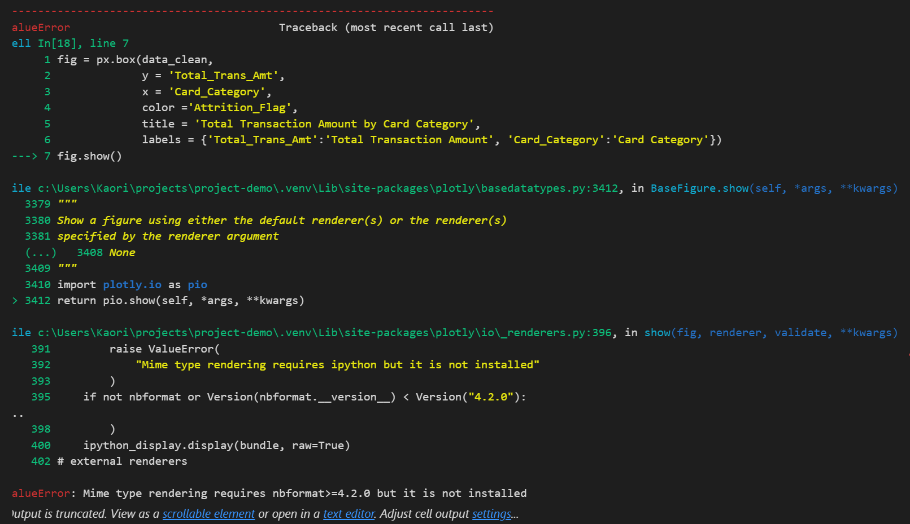

 

# Credit Card Attrition Analysis

**Credit Card Attrition Analysis** is a comprehensive data analysis tool designed to streamline data exploration, analysis, and visualisation. The tool supports multiple data formats and provides an intuitive interface for both novice and expert data scientists.

## Dataset Content
The dataset consist of 10,000 customers' age, salary, marital status, credit card limit, credit card category, etc. The dataset is available from [Credit Card customers](https://www.kaggle.com/datasets/sakshigoyal7/credit-card-customers/data)

## Business Requirements
* Assess which customers are likely to churn (when a customer ceases to be a customer) so that the bank can take proactive measures to retain them. Develop analytical reports to identify customers at risk of churning and provide actionable insights to reduce churn rates. The goal is to assess which customers are likely to churn using customer data and develop strategies to improve retention.

## Hypothesis and how to validate?

1. Customers with lower card categories are more likely to churn.
   * Create a bar chart of churn rate by card category.

2. The lower the total transaction amount, the higher their likelihood of churning.
   * Create a histogram to visualise total transaction amount for attrited and exisiting customers.     

3. Customers with lower total revolving balances are likely to churn.
   * Create a box plot to compare total revolving balance for attited customers and exsisting customers.

4. To further explore hypothesis 3 - Customer with lower total revolving balance AND lower credit limit are likely to churn
   *  Create a scatter plot to see the relationship between those two variables.
 

## Project Plan
* Data collection
* Data Cleaning  
* Data Analysis
* Hypothesis Testing
* Insight generation
* Reporting

I chose these methods to follow a logical step by step approach. Started with data collection to gather relevant information, data cleaning to handle any incinsistency in the data and prepared for analysis. Analysed data to explore patterns then tested hypothesis to validate assumptions. Generated insight based on the results. By following these steps, I could understand the dataset better and generate insights based on the findings.

## The rationale to map the business requirements to the Data Visualisations
* The bank wants to know who are likely to churn and prevent from churning. 
I assumed that generating actionable insights would require more advanced analysis than I could currently perform, so I focused on identifying obvious patterns and filtering out assumptions in preparation for the next step.

## Analysis techniques used
* List the data analysis methods used and explain limitations or alternative approaches.
* How did you structure the data analysis techniques. Justify your response.
* Did the data limit you, and did you use an alternative approach to meet these challenges?
* How did you use generative AI tools to help with ideation, design thinking and code optimisation?
* Tried to create a pair plot using entire dataset to find any patterns before addressing hypothesis but it kept giving me errors. To address the issue, I picked few columns of interest and created a dataset then created a pair plot showing multiple variable relationships. 
## Ethical considerations
* The data was anonymised. Ethical consideration was addressed with this project.

## Unfixed Bugs
I tried to create a plot using Plotly, but something wasn’t working properly on my computer. Neil was very helpful and tried to assist, but we couldn’t figure out the cause of the issue. I uninstalled `nbformat` version 5.10.4 and installed version 4.2.0 instead. Even though the terminal confirmed that version 4.2.0 was installed, I continued to receive the same error message.

 

I uninstalled and reinstalled requirements.txt, and also ran `pip install ipython` as Neil suggested. However, the issue persisted, insted of `ValueError`, it is showing `alueError` as shown in the image below.

Please mention unfixed bugs and why they were not fixed. This section should include shortcomings of the frameworks or technologies used. Although time can be a significant variable to consider, paucity of time and difficulty understanding implementation are not valid reasons to leave bugs unfixed.
* Did you recognise gaps in your knowledge, and how did you address them?
* If applicable, include evidence of feedback received (from peers or instructors) and how it improved your approach or understanding.

## Development Roadmap
The chanlleges I faced 
- Creating project plan - I wasn't sure where to start so I just dived in before planning much which was not a great idea. I have a little more understanding of what needs to be done so next project, I will plan better and document more as I go. 
- Error and trial - I had many errors and google, chatGPT was a gret help to understand what I did wrong. I should have documented more of my error. 

In the next project, I would like to use more statistics in my analysis for my next project. I am not confident in using statistical methods so I chose not to apply in this project but I am interested in and would like to have deeper understandings.

## Main Data Analysis Libraries
* Pandas to load and clean data
* Numpy to perform calculation 
* Seaborn to create visualisation
* Matplotlib to visualise the created plots
* Plotly to create interactive plot

## Credits 

* I got visualisation idea from here - [From Data to Viz](https://www.data-to-viz.com/#network).  Helped me decide which plot to make to visualise dataset.
* Checked the code with [seaborn](https://seaborn.pydata.org/index.html#).
* When I encountered errors and needed a guidance, I used [ChatGPT](https://chatgpt.com/), [W3Schools](https://www.w3schools.com/), [GeeksforGeeks](https://www.geeksforgeeks.org/)
* Checked this page to know how to align image to the right in README [DavidWells](https://gist.github.com/DavidWells/7d2e0e1bc78f4ac59a123ddf8b74932d)

## Acknowledgements
Thanks to all my tutors. I’ve really been enjoying the course so far, and your support has helped me complete this project.
* Emma Lamont - Very supportive course facilitator. Thank you for your support and I am greatful to be looked after.
* John  Rearden - Thank you for great sessions to explain complex consepts clearly. 
* Mark Briscoe - Thank you for your humour and relaxed teaching style. It made the learning environment more enjoyable.
* Niel McEwen - Thank you for making course material easy to follow and quick response for my query.